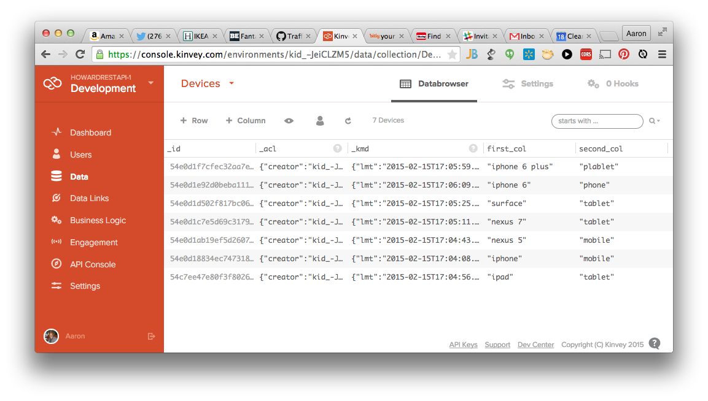
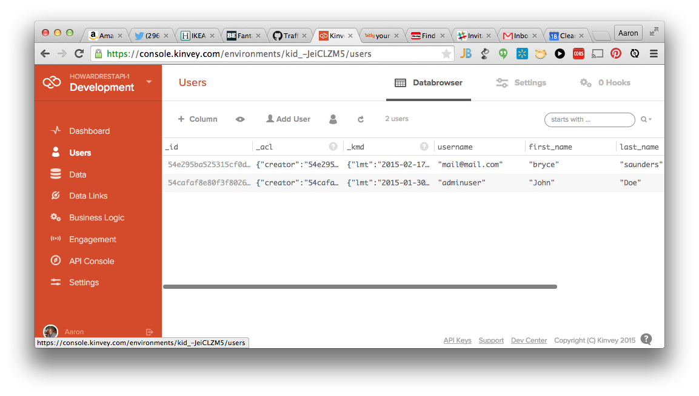

IonicFramework Example for Querying Data w/Kinvey
===========
######There is an [AngularJS + Bootstrap Example](https://github.com/aaronksaunders/AngularKinveyDatastore) here, if Ionic is not your thing
----

###Getting Started
------------
For this sample to work, you must [create an account in Kinvey](https://console.kinvey.com) and update the constants declared in the `app.js` file.

In the kinvey console, look on the bottom of the page for the link that says "appKeys" to display the required information.


You will also need to create a collection name `Devices` and add `first_col` and `second_col` and columns in the collection. See example databrowser screen below from sample Kinvey Collection



And finally you will need to have created a user object so you can log in to your application. You add the user to the application by clicking on "Users" in the left navigation screen and then clicking "Add Users" on the top menu of the new page



```JavaScript
// app.js edit this code 
app.constant("KINVEY", {
    "APPINFO": {
        "appKey" : "YOUR APP ID",
        "appSecret" : "YOUR APP SECRET VALUE"
    }
});
```
###Create a User
------------
The kinvey library provides a function for creating a user in the Kinvey App. You need to provide the information as a parameter for the function and Kenvey does the rest. The function will return the successfully created user or an error. When the user is created, he is automatically logged into the system.

We have modularized this functionality into a Service called `KinveyService`, see the actual code in the file [`services.js`](www/js/services.js)

[See the Kinvey Documentation on Creating Users](http://devcenter.kinvey.com/angular/guides/users#signup)

###Logging in a User
------------
Kinvey allows you to log a user into the system using the Kinvey Library. The login process must happen after the `Kinvey.init()` has completed successfully. If Kinvey already has an [Active User](http://devcenter.kinvey.com/angular/guides/users#ActiveUser), that user object will be returned from the `Kinvey.init()` call.

In the KinveyService, there is no need to keep track of the ActiveUser since Kinvey does that for us, all we do is return the ActiveUser on initialization or we return null. If there is no ActiveUser, the application will then force the current user to a login page where they can login or select the option to create an account

We have modularized this functionality into a Service called `KinveyService`, see the actual code in the file [`services.js`](www/js/services.js)

* [See the Kinvey Documentation on Logging in Users](http://devcenter.kinvey.com/angular/guides/users#login)
* [See the Kinvey Documentation on Active Users](http://devcenter.kinvey.com/angular/guides/users#ActiveUser)

###How Routes are Secured
------------


###Querying Data
------------


We will be accessing the Kinvey data using the kinvey angularJS library that means there is no need to work directly with [ngResource](https://docs.angularjs.org/api/ngResource) or [$http](https://docs.angularjs.org/api/ng/service/$http); Kinvey has that covered for you. 

Checkout the [Getting Started](http://devcenter.kinvey.com/angular/guides/getting-started) information for more details

Format of the JSON Data for the `Devices` collection in Kinvey when doing a query.

```JavaScript
  {
    "_id": "54c7ee47e80f3f8026009156",
    "first_col": "ipad",
    "second_col": "tablet",
    "_acl": {
      "creator": "kid_-JeiCLZM5"
    },
    "_kmd": {
      "lmt": "2015-02-15T17:04:56.335Z",
      "ect": "2015-01-27T20:00:07.394Z"
    }
  },
```

###Screenshots
------------

#####Login Screen


#####List View w/Results and User Object Displayed

