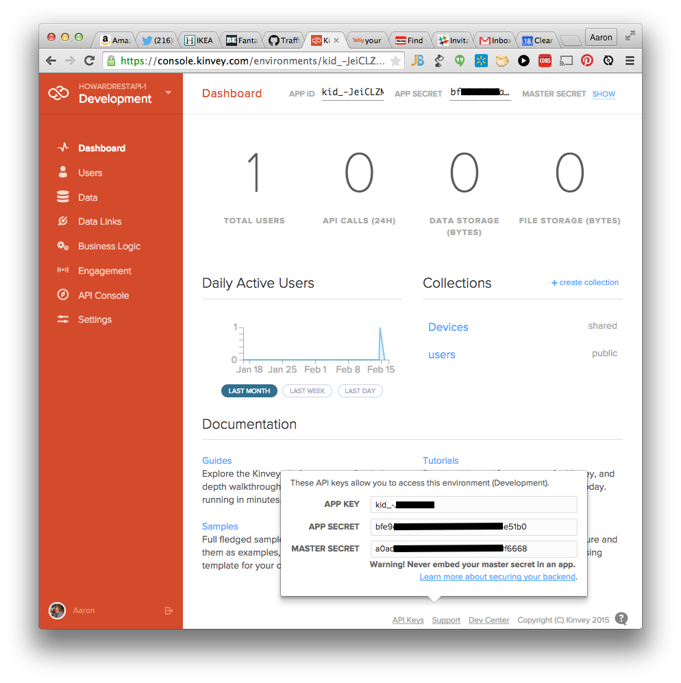

IonicFramework Example for Querying Data w/Kinvey
===========
######There is an [AngularJS + Bootstrap Example](https://github.com/aaronksaunders/AngularKinveyDatastore) here, if Ionic is not your thing
----

###Getting Started
------------
For this sample to work, you must [create an account in Kinvey](https://console.kinvey.com) and update the constants declared in the `app.js` file.

In the kinvey console, look on the bottom of the page for the link that says "appKeys" to display the required information.



You will also need to create a collection name `Devices` and add `first_col` and `second_col` and columns in the collection. See example databrowser screen below from sample Kinvey Collection


And finally you will need to have created a user object so you can log in to your application. You add the user to the application by clicking on "Users" in the left navigation screen and then clicking "Add Users" on the top menu of the new page


```JavaScript
// app.js edit this code 
app.constant("KINVEY", {
    "APPINFO": {
        "appKey" : "YOUR APP ID",
        "appSecret" : "YOUR APP SECRET VALUE"
    }
});
```

Format of the JSON Data for the `Devices` collection in Kinvey when doing a query.

```JavaScript
  {
    "_id": "54c7ee47e80f3f8026009156",
    "first_col": "ipad",
    "second_col": "tablet",
    "_acl": {
      "creator": "kid_-JeiCLZM5"
    },
    "_kmd": {
      "lmt": "2015-02-15T17:04:56.335Z",
      "ect": "2015-01-27T20:00:07.394Z"
    }
  },
```

###Screenshots
------------

#####Login Screen


#####List View w/Results and User Object Displayed

